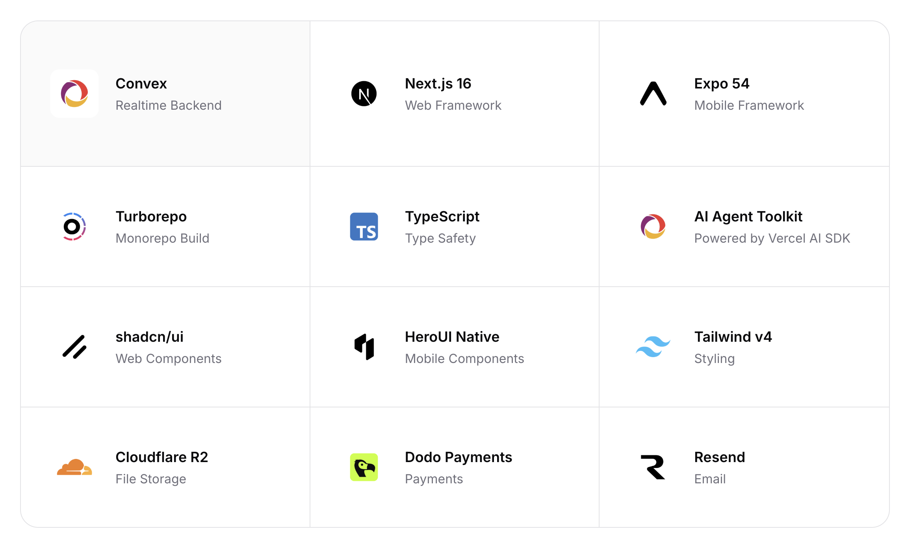

# Ship Superfast



Monorepo starter kit. **Convex + Next.js + Expo** with auth, teams, payments, storage, email, AI, and push notifications pre-wired.

Made by [Raj Breno](https://rajbreno.com)

## Tech Stack

| Layer | Tech |
|-------|------|
| Monorepo | Turborepo + pnpm |
| Web | Next.js 16 + shadcn/ui + Tailwind v4 |
| Mobile | Expo 54 + HeroUI Native + Uniwind |
| Docs | Fumadocs |
| Backend | Convex |

**Built-in integrations:** Google OAuth, Magic Link, Cloudflare R2, Dodo Payments, Resend, OpenAI (agents + RAG), Expo Push Notifications.

## Quick Start

```bash
git clone https://github.com/rajbreno/ship-superfast.git my-app
cd my-app
pnpm install
```

### 1. Convex Backend

```bash
cd packages/convex
npx convex dev          # Creates project + generates .env.local
```

### 2. Environment Files

```bash
echo "NEXT_PUBLIC_CONVEX_URL=https://your-deployment.convex.cloud" > apps/web/.env.local
echo "EXPO_PUBLIC_CONVEX_URL=https://your-deployment.convex.cloud" > apps/mobile/.env.local
```

### 3. Auth Setup (Required)

**Google OAuth** — [Cloud Console > Credentials](https://console.cloud.google.com/apis/credentials):

```bash
cd packages/convex
npx convex env set AUTH_GOOGLE_ID "your-client-id"
npx convex env set AUTH_GOOGLE_SECRET "your-client-secret"
```

Redirect URI: `https://your-deployment.convex.site/api/auth/callback/google`

**JWT Keys:**

```bash
openssl genpkey -algorithm RSA -pkeyopt rsa_keygen_bits:2048 -out /tmp/jwt_private.pem
openssl pkey -in /tmp/jwt_private.pem -pubout -out /tmp/jwt_public.pem

npx convex env set JWT_PRIVATE_KEY -- "$(cat /tmp/jwt_private.pem)"

node -e "
const crypto = require('crypto');
const pub = crypto.createPublicKey(require('fs').readFileSync('/tmp/jwt_public.pem'));
const jwk = pub.export({ format: 'jwk' });
jwk.use = 'sig'; jwk.alg = 'RS256'; jwk.kid = 'convex-auth-key';
console.log(JSON.stringify({ keys: [jwk] }));
" > /tmp/jwks.json

npx convex env set JWKS -- "$(cat /tmp/jwks.json)"
rm /tmp/jwt_private.pem /tmp/jwt_public.pem /tmp/jwks.json
```

**Site URL:**

```bash
npx convex env set SITE_URL "http://localhost:3000"
```

### 4. Optional Services

```bash
# Magic Link auth
npx convex env set AUTH_RESEND_KEY "re_..."

# File storage (Cloudflare R2)
npx convex env set R2_ACCESS_KEY_ID "..." R2_SECRET_ACCESS_KEY "..." R2_ENDPOINT "..." R2_BUCKET "..." R2_TOKEN "..."

# AI (OpenAI)
npx convex env set OPENAI_API_KEY "sk-..."

# Payments (Dodo)
npx convex env set DODO_PAYMENTS_API_KEY "..." DODO_PAYMENTS_ENVIRONMENT "test_mode" DODO_PAYMENTS_WEBHOOK_SECRET "..."

# Transactional email (Resend)
npx convex env set RESEND_API_KEY "re_..."
```

## Running

```bash
pnpm dev                    # All apps + backend

# Individual
cd apps/web && pnpm dev     # http://localhost:3000
cd apps/mobile && pnpm dev  # Expo dev server
cd apps/docs-site && pnpm dev # http://localhost:3001
cd packages/convex && pnpm dev

pnpm build                  # Build all
pnpm check-types            # Type check all
```

## Project Structure

```
apps/
  web/            → Next.js + shadcn/ui
  mobile/         → Expo + HeroUI Native
  docs-site/      → Fumadocs

packages/
  convex/         → Backend (auth, storage, payments, email, AI)
  shared/         → Shared types, constants, utils
```

## Deployment

```bash
# Backend — deploy first
cd packages/convex && npx convex deploy

# Mobile
cd apps/mobile
npx eas build --platform ios && npx eas submit --platform ios
npx eas build --platform android && npx eas submit --platform android
```

**Web & Docs** — connect repo to [Vercel](https://vercel.com), set root directory to `apps/web` or `apps/docs-site`, add `NEXT_PUBLIC_CONVEX_URL`, deploy.

## Docs

Full documentation lives in `apps/docs-site/` — run `cd apps/docs-site && pnpm dev` to view locally.

